# Investment Data Engine

## Purpose

NeuroTrader's investment data foundation follows one authority chain:

`RAW DATA -> NORMALIZED DATA -> VERIFIED CALCULATIONS -> SCREENING -> AI RESEARCH -> HUMAN DECISION`

The LLM is not a financial calculator, source of market facts, approval authority, or trading authority. Missing values remain `DATA NOT AVAILABLE`; they are never silently replaced with zero.

## Architecture

```mermaid
flowchart LR
  SEC["SEC EDGAR"] --> INGEST["Rate-limited ingestion"]
  MARKET["Licensed market provider"] --> INGEST
  INGEST --> RAW["Immutable raw observations"]
  RAW --> NORM["Versioned XBRL normalization"]
  NORM --> PERIODS["Annual / quarter / TTM engine"]
  PERIODS --> METRICS["Deterministic metrics"]
  METRICS --> SCREEN["Deterministic screens"]
  SCREEN --> RESEARCH["AI research with citations"]
  RESEARCH --> COMMITTEE["Frozen committee packet"]
  COMMITTEE --> HUMAN["Authorized human decision"]
  HUMAN --> THESIS["Immutable original thesis"]
  THESIS --> PORTFOLIO["Monitoring / risk / attribution"]
```



Logical boundaries are implemented in separate modules. AI routes consume verified data and evidence snapshots; they do not write raw or normalized financial facts.

## Data Model

Migration: `supabase/migrations/20260916000600_investment_data_engine.sql`

Core groups:

| Layer | Tables |
| --- | --- |
| Source governance | `investment_data_sources` |
| Company master | `investment_companies`, `investment_securities`, `investment_security_identifiers` |
| Ingestion | `investment_ingestion_responses`, `investment_ingestion_checkpoints`, `investment_ingestion_leases`, `investment_sec_filings` |
| Facts | `investment_sec_raw_facts`, `investment_canonical_concepts`, `investment_xbrl_concept_mappings`, `investment_normalized_facts` |
| Calculations | `investment_calculation_runs`, `investment_financial_metrics` |
| Market data | `investment_market_observations`, `investment_corporate_actions` |
| Research triage | `investment_screen_definitions`, `investment_screen_runs`, `investment_screen_results`, `investment_watchlist_entries`, `investment_material_change_events` |
| Audit | `investment_audit_events` |

SEC raw responses, filings, facts, calculations, screen runs, market observations, change events, and audit events are append-only. Mutable checkpoints track freshness without rewriting source history.

## SEC EDGAR

`lib/neuroSecEdgarClient.ts` enforces:

- An identifying `User-Agent` with monitored contact information.
- HTTPS requests to official SEC hosts only.
- A configurable rate below the SEC limit; default is 8 requests/second.
- Exponential backoff, `Retry-After`, timeout, request deduplication, ETag and Last-Modified revalidation.
- Durable response caching with SHA-256 receipts.
- Incremental submissions-history batches with durable checkpoints.
- Distributed per-company ingestion leases so concurrent workers cannot regress a checkpoint.
- Company submissions, Company Facts, Company Concept, historical submission files, filing documents, and official bulk dataset locations.

CIK is the SEC company identity. Tickers are dated identifiers and may change. The Company Master preserves inactive entities, delistings, mergers, bankruptcies, and former identifiers rather than deleting them.

Required environment variables:

```text
SEC_USER_AGENT="NeuroTrader research operations@example.com"
SEC_REQUESTS_PER_SECOND=8
SEC_FETCH_TIMEOUT_MS=15000
SEC_MAX_RETRIES=4
SEC_SUBMISSION_HISTORY_FILES_PER_JOB=5
CRON_SECRET="..."
```

## Point-In-Time Contract

Every normalized fact distinguishes the economic period from public availability:

- `period_start_date` / `period_end_date`: when the economics occurred.
- `filing_date` / `accepted_at` / `public_at`: when the information became available.
- `ingested_at`: when NeuroTrader received it.

If the SEC response lacks a verified acceptance time, availability defaults conservatively to filing-day end. `investment_facts_as_of(company, timestamp)` and the investment-data API filter on `public_at`. Metric reads additionally require `calculation_runs.input_cutoff_timestamp <= requested as-of timestamp`. Recalculating an old period today therefore cannot leak future facts into a historical view.

Original and amended facts remain separate versions. The UI or research caller may request the latest version known at an as-of timestamp or the first published version. Mapping priority resolves equivalent XBRL tags deterministically.

## Normalization And Periods

`lib/neuroFinancialStatements.ts` preserves original taxonomy, concept, value, unit, accession, filing metadata, frame, raw payload, mapping version and lineage hash.

Supported canonical concepts cover income statement, balance sheet, cash flow, equity, diluted shares, SBC and depreciation/amortization inputs. Unknown tags remain in raw storage and appear in the unmapped-concepts report; they are not guessed into a canonical field.

Duration rules:

- Q1 reported duration remains a quarter.
- Q2 and Q3 standalone quarters may be derived from YTD values with formula and input lineage.
- Q4 may be derived as `FY - Q1 - Q2 - Q3`.
- TTM is the sum of four traceable discrete quarters.
- A derived fact is labeled `DERIVED`; a source fact is labeled `REPORTED`.

## Deterministic Metrics

`lib/neuroDeterministicMetrics.ts` calculates without an LLM:

- Revenue growth and up-to-five-year revenue CAGR.
- Gross, operating, net and FCF margins.
- Operating cash flow and FCF.
- FCF conversion and cash conversion.
- ROA, ROE and configurable ROIC.
- Current ratio, debt/equity, debt/EBITDA, net debt/EBITDA and interest coverage.
- CapEx, R&D, SG&A and SBC ratios.
- Share dilution, working capital and working-capital change.

Authoritative formulas include:

- `FCF = operating cash flow - abs(capital expenditures)`
- `NOPAT = operating income * (1 - tax rate)`
- Default `ROIC = NOPAT / average(debt + equity - cash)`

Each stored metric exposes formula, formula version, inputs, source fact IDs, calculation time, calculation run and trace hash. A missing CapEx, D&A, prior balance, denominator or currency match produces `DATA NOT AVAILABLE`.

## Screening And Valuation

`lib/neuroScreeningEngine.ts` evaluates configurable criteria and returns `PASS`, `FAIL`, or `DATA NOT AVAILABLE` for every condition. It never creates an investment score or implied recommendation. Initial templates cover Quality Compounder, Value Candidate, Quality at a Reasonable Price, Price Dislocation and Balance Sheet Strength.

FCF yield is only derived when verified FCF and a stored, licensed market-cap observation use compatible currencies. Absent licensed market data, the criterion remains unavailable.

Valuation modules provide:

- Downside, base and upside FCFF DCF scenarios with disclosed assumptions and sensitivity matrices.
- Reverse DCF combinations describing what must be true for the current value to make sense.
- Comparable multiples and historical valuation ranges without automatic cheap/expensive conclusions.

## Daily Operation

Weekday workflow:

1. `/api/neuro-analysis/investment-data/schedule` selects only active watchlist companies and companies with frozen approved theses.
2. Durable `investment_data_refresh` jobs update SEC data in bounded batches.
3. The worker normalizes statements, derives periods, recalculates metrics and detects material financial changes.
4. `/api/neuro-analysis/daily-office/schedule` generates thesis-aware human review briefings.

The system does not send the whole market to an LLM. Wider-universe screening should be run deterministically against canonical stored metrics before AI research is queued.

## Governance And Security

- Server-side authentication, owner gates, quotas and rate limits protect APIs.
- Emergency controls can stop AI proposals, broker connectivity, new orders and transaction processing, or switch the system to read-only.
- Raw/history tables reject updates and deletes.
- Sensitive actions use a tamper-evident per-user audit hash chain.
- External filings, PDFs, websites and news are treated as untrusted evidence, never instructions.
- AI prompts prohibit following instructions embedded in retrieved content.
- AI never receives bank credentials, broker withdrawal credentials, database administrator credentials or unnecessary investor PII.
- Investment Committee approval remains an authorized human action. AI cannot approve an investment.

## Data Licensing Gate

`lib/neuroMarketDataProvider.ts` defines the provider interface and enforces use-specific rights for storage, derivation, display and redistribution. Commercial sources remain disabled for canonical persistence until their production contract is reviewed and the corresponding permissions are explicitly enabled.

This is a release gate, not a technical TODO that may be bypassed. Demo data is synthetic and must never be mixed with live research evidence.

## Verification

Unit coverage includes:

- Point-in-time and amendment behavior.
- XBRL mapping priority.
- Q2/Q3/Q4 and TTM derivation.
- Missing-data and divide-by-zero behavior.
- Deterministic metrics, screens, DCF, valuation, provider licensing and material-change thresholds.
- Exact unit-accounting contribution example.
- Prompt-injection policy.

Before deployment:

1. Apply all Supabase migrations in timestamp order.
2. Configure and monitor `CRON_SECRET` and SEC contact identity.
3. Approve one production market-data provider's legal rights before enabling its canonical adapter.
4. Run `npm run verify:release` and database authorization tests.
5. Validate backup/restore and audit reconstruction in the target environment.

## Known External Dependencies

- Current price, market cap, split-adjusted price history and corporate actions require an approved market-data adapter. The abstraction and canonical tables exist; unlicensed vendor data is intentionally not persisted.
- Sector and industry classification require an approved reference source or reviewed internal mapping.
- Future real-money partner processing remains disabled. Capital-account code and exact decimal unit tests prepare the architecture but do not activate custody, withdrawals or investor servicing.
